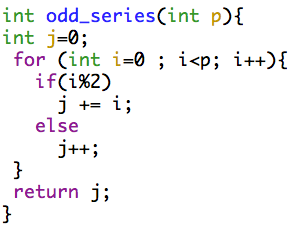
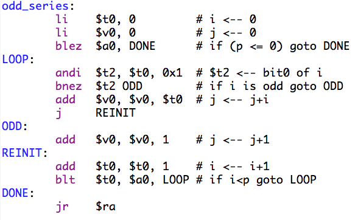
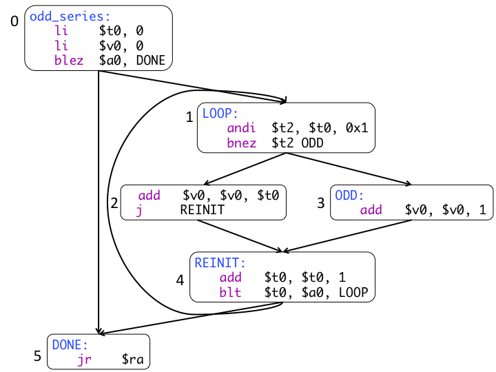

# CMPUT 229 Lab 5 - Basic Blocks

## Information

A Control Flow Graph (CFG) is an abstract representation of a procedure in a computer program. A CFG represents the flow of execution through a program and is often used by compilers to apply code transformations. Every node of a CFG represents an entity known as a *basic block*. A basic block is a sequence of instructions with the following restriction:

* whenever any instruction in a basic block is executed, all instructions in that basic block must be executed;
* execution must start by the first instruction of the basic block and must continue through to the last instruction;
* a branch or jump can only appear as the very last instruction of a basic block;
* the only instruction that can be the target of a branch or jump is the first instruction of a basic block.

A CFG represents all the possible flows of execution between the basic blocks of a procedure in a program. The following illustration shows a portion of C code, the corresponding MIPS assembly code, and the CFG representation of the code.

<p align="center">
  
  
</p>
<p align="center">
  
</p>

For this assignment, assume that basic blocks are numbered in the order in which they appear in the assembly code. The basic block starting with the first statement in the procedure is basic block `0`. The number for basic blocks are shown in the CFG for the example.

The first instruction of a basic block is called the *leader* of the basic block. A simple algorithm to identify all the basic blocks in a procedure consists of finding the *leader* of each basic block. Once all the leaders are identified, each basic block starts at a leader and continues up to, but not including, the next leader. These leaders can be found using three simple rules:

1.  The first statement in the procedure is a leader.
2.  Any statement that is the target of a branch or jump is a leader.
3.  Any statement that immediately follows a branch or jump is a leader.

Given a listing of the assembly instructions of a procedure, each basic block can be described by the address of the leading instruction along with the number of instructions in the block. These two pieces of information uniquely identify each block.

For instance, a possible layout in memory for the actual assembly code for the example above is as follows (basic blocks are separated by blank line for easier visualization):

```
    [00400084] 34080000  ori $8, $0, 0                     ; 52: li $t0, 0 # i
    [00400088] 34020000  ori $2, $0, 0                     ; 53: li $v0, 0 # j
    [0040008c] 18800009  blez $4 36 [DONE-0x0040008c]      ; 54: blez $a0, DONE # if (p <=0) goto DONE

    [00400090] 310a0001  andi $10, $8, 1                   ; 56: andi $t2, $t0, 0x1 # $t2
    [00400094] 15400003  bne $10, $0, 12 [ODD-0x00400094]

    [00400098] 00481020  add $2, $2, $8                    ; 58: add $v0, $v0, $t0 # j
    [0040009c] 08100029  j 0x004000a4 [REINIT]             ; 59: j REINIT

    [004000a0] 20420001  addi $2, $2, 1                    ; 61: add $v0, $v0, 1 # j

    [004000a4] 21080001  addi $8, $8, 1                    ; 63: add $t0, $t0, 1 # i
    [004000a8] 0104082a  slt $1, $8, $4                    ; 64: blt $t0, $a0, LOOP # if i is odd goto ODD
    [004000ac] 1420fff9  bne $1, $0, -28 [LOOP-0x004000ac]

    [004000b0] 03e00008  jr $31                            ; 66: jr $ra
```

Therefore the six basic block are uniquely identified as shown in the following table:

| Basic Block | Leader's Address | Length |
| ----------- | ---------------- | ------ |
| 0 | `0x00400084` | 3 |
| 1 | `0x00400090` | 2 |
| 2 | `0x00400098` | 2 |
| 3 | `0x004000a0` | 1 |
| 4 | `0x004000a4` | 3 |
| 5 | `0x004000b0` | 1 |

The nodes of a CFG are the basic blocks, and the edges of the CFG show the possible flow of execution from block to block. For example, blocks ending in a conditional branch have 2 edges leaving them, one going to the target of the taken branch, and the other going to the basic block that is reached by falling through to the next instruction. Blocks ending with a jump have only one exiting edge leading to the basic block that is the target of the jump.

Each edge of the CFG can be represented as a tuple `<s, t>` where `s` is the address of the leader of the source basic block and `t` is the address of the leader of the basic block that is the target of the edge. Using this representation, in the example above the eight edges of the CFG can be represented by the following tuples:

| Source Address | Target Address |
| -------------- | -------------- |
| `0x00400084` | `0x00400090` |
| `0x00400084` | `0x004000b0` |
| `0x00400090` | `0x00400098` |
| `0x00400090` | `0x004000a0` |
| `0x00400098` | `0x004000a4` |
| `0x004000a0` | `0x004000a4` |
| `0x004000a4` | `0x00400090` |
| `0x004000a4` | `0x004000b0` |

The CFG representation of a procedure is routinely used by compilers and optimizers for several analysis, including the identification of unreachable code, the propagation of constant values, *etc*.

### Bit Vectors

A *Bit Vector* is a type of array that stores individual bits compactly. Bits must be singled out and altered using bitwise manipulations. A bit vector is usually stored in memory. The number of words used to store a bit vector is usually the minimum number of words that is necessary to accommodate all bits. For example, a 70-bit bit vector requires three 32-bits words of storage, while a 32-bit bit vector would require a single 32-bit word for storage. Bit vectors are indexed over each bit.

### Dominators

CFGs have a special basic block called the **start** node. The **start** basic block has no predecessors in the CFG. A CFG node **b** *dominates* another CFG node **c** if and only if every path from **start** to **c** must include **b**. In other words, **b** dominates **c** if it is impossible to reach **c** without going through **b**. Thus, by definition, **start** dominates all nodes in a CFG. By definition, every basic block dominates itself.

Efficient algorithms for computing dominators involve complex logic and traversal of the CFG. Luckily, a simple, but rather inefficient, algorithm can be used to calculate dominators. This simple algorithm is one of iterative refinement and works as follows:

```cpp
// G = (V,E) is the Control Flow Graph
// Dom(n_i) is the set of dominators of n_i
// V is the set of all nodes n_i
// The starting node only dominates itself
Dom(n_0) = {n_0}  

// For the rest, initially assume that each node is dominated by all nodes
for each n_i in (V - {n_0})
    Dom(n_i) = V  

// iteratively update the dominators
while any Dom(n_i) changed
    // Dom(n_i) = {n_i} ∪ {∩ n_j | (n_j, n_i) ∊ E}
    for each (n_j, n_i) ∊ E  
        Dom(n_i) = {n_i} ∪ (Dom(n_i) ∩ Dom(n_j))
```

The previous algorithm does the following:

*   **Step 0**: Initially `Dom(n_0) = n_0` and `Dom(n_i) = V` for all `i` ≠ 0.
*   **Step 1**: For each edge `(n_j, n_i)` in the CFG, update `Dom(n_i)`
*   **Step 2**: If any `Dom(n_i)` changes in Step 1, then repeat Step 1.

For the example above, after the initialization, each one of the edges in the CFG would be processed in the first iteration producing the following changes to the dominator sets:

| Edge | Change | Bit Vector |
| ---- | ------ | ---------- |
| (n_0, n_1) | Dom(n_1) = {n_0, n_1} | 000011 |
| (n_0, n_5) | Dom(n_5) = {n_0, n_5} | 100001 |
| (n_1, n_2) | Dom(n_2) = {n_0, n_1, n_2} | 000111 |
| (n_1, n_3) | Dom(n_3) = {n_0, n_1, n_3} | 001011 |
| (n_2, n_4) | Dom(n_4) = {n_0, n_1, n_2, n_4} | 010111 |
| (n_3, n_4) | Dom(n_4) = {n_0, n_1, n_2} | 000111 |
| (n_4, n_1) | Dom(n_1) = {n_0, n_1} | 000011 |
| (n_4, n_5) | Dom(n_5) = {n_0, n_5} | 100001 |

Since there were several changes to the dominator sets, the algorithm will process again all the edges of the CFG. This time, there will be no changes and the dominator sets for each node in the CFG are the ones shown above. As the table shows, the set of dominators for each node in the CFG can be represented as a bit vector. The only requirement is that each bit vector must have at least *k* bits where *k* is the number of nodes in the CFG. An advantage of using such compact bit vector notation for the dominator sets is that the algorithm to find the dominators itself can use bit vectors for a much more efficient implementation. With bit vectors, a union is simply an `OR` operation and an intersection is simply an `AND` operation. For instance, for the change that occurs when the first edge (n_0, n_1) is processed we need to compute:

```
Dom(n_1) = {n_1}  ∪ (Dom(n_1) ∩ Dom(n_0))
```

Which becomes the following bit vector operations:

```
Dom(n_i) = 000010 OR (111111 AND 000001) = 000011
```

### MIPS Control Flow Instructions

MIPS has a variety of control flow instructions, each of which require slightly different behaviour. These instructions are listed below. In the encoding, `s` specifies a source register, `t` specifies a target register, `d` specifies a destination register, `a` specifies an absolute address, and `o` specifies an offset.

| **Instruction** | **Encoding** |
| --- | --- |
| `beq $s, $t, offset` | `0001 00ss ssst tttt oooo oooo oooo oooo` |
| `bgez $s, offset` | `0000 01ss sss0 0001 oooo oooo oooo oooo` |
| `bgezal $s, offset` | `0000 01ss sss1 0001 oooo oooo oooo oooo` |
| `bgtz $s, offset` | `0001 11ss sss0 0000 oooo oooo oooo oooo` |
| `blez $s, offset` | `0001 10ss sss0 0000 oooo oooo oooo oooo` |
| `bltz $s, offset` | `0000 01ss sss0 0000 oooo oooo oooo oooo` |
| `bltzal $s, offset` | `0000 01ss sss1 0000 oooo oooo oooo oooo` |
| `bne $s, $t, offset` | `0001 01ss ssst tttt oooo oooo oooo oooo` |
| `j target` | `0000 10aa aaaa aaaa aaaa aaaa aaaa aaaa` |
| `jal target` | `0000 11aa aaaa aaaa aaaa aaaa aaaa aaaa` |
| `jr $s` | `0000 00ss sss0 0000 0000 0000 0000 1000` |


Every list instruction, other than `jr`, can be uniquely identified by the primary `OpCode` (the 6 most significant bits). For `jr`, the easiest way to recognize it is to clear the `s` bits and compare the instruction against `0x08`.

#### Offsets to Absolutes

Branches provide offsets rather than target addresses, so you will need to do the conversion yourself. The following algorithm is recommended to convert branch offsets to addresses:

1.  Isolate the offset field.
2.  Multiply the offset by 4 to convert the word offset into bytes.
3.  Add 4, to account for the fact that the `PC` would be ahead by 4.
4.  Sign extend the result to 32 bits.
5.  Add this value to the address of the branch instruction itself to produce the target address.

To calculate the target address of a jump, retain the 4 most significant bits from the PC, after incrementing it by 4. To calculate the target for jumps, the following algorithm is recommended:

1.  Add 4 to the address of the jump instruction.
2.  Extract bits `28-31` from the resulting sum.
3.  Extract the address field from the jump instruction.
4.  Multiply the address field by 4, to convert from words to bytes.
5.  `or` the top 4 bits from Step 2 with the product above to generate your target address.

Register-based jumps are far more complex to calculate targets for, generally requiring dynamic analysis (more information on dynamic analysis is available [here](http://en.wikipedia.org/wiki/Dynamic_program_analysis)). For this assignment, you do not need to determine the target of these jumps. Whenever you encounter such a jump, it will merely signify the end of a block.

## Assignment

One of the things that you will be required to return is a list of dominator bit vectors. Each bit in each bit vector corresponds to a basic block, as returned in `0($sp)`, such that the first block returned corresponds to bit 0, the second corresponds to bit 1, etc. The list of bit vectors should be index-correlated to the list of basic blocks, and represent the dominators for each block. Non-executable blocks should have `1`s filling their bit vectors, though they should still be zero-padded where the bit vector does not consume the entire word.

Your assignment is to implement a MIPS method `getControlFlow` that takes as argument in `$a0` the address of the first word in a MIPS method represented in binary. The end of the method is marked by a sentinel word `0xFFFFFFFF`. Your method must return:

* `$v0` - The number of basic blocks in the procedure.
* `$v1` - The number of edges in the CFG of the procedure.
* `0($sp)` - A pointer to memory that you are responsible to allocate, containing all the basic blocks in the procedure. The grading script expects this basic-block list to follow these constraints:
    * Basic blocks appear in the list in ascending order of the address of their leaders.
    * Each basic block is represented by two words:
        * the first word is the memory address of the leader;
        * the second word is the size of the basic block, in number of instructions.
* `4($sp)` - A pointer to memory that you are responsible to allocate, containing a list of the edges in the CFG. The grading scripts expects the list to obey the following constraints:
    * Edges appear in ascending order of the address of the leader of its source basic block;
    * Edges that have the same source appear in ascending order of the address of the leader of the target basic block.
    * Each edge is represented by two words:
        * the first word is the address of the leader of the source basic block;
        * the second word is the address of the leader of the destination basic block.
* `8($sp)` - A pointer to memory that you are responsible to allocate, containing a list of dominator sets:
    * The dominator sets must appear in this list in the same order in which the basic blocks appear in the binary representation in the input.
    * Each dominator set will be represented by a bit vector.
    * Each bit vector will occupy the minimum number of words required for its storage.

It is your responsibility to allocate 3 additional words at the top of the stack to hold these pointers. No duplicate edges should be included, and a block should only have an edge to itself if it does branch/jump to the top of itself. Blocks should be sorted numerically by leader address, lowest first. Edges returned should be sorted first by source address, then by target address, numerically lowest first.

### Printing the Output of your `getControlFlow`

To assist you with testing, you are provided with a testing file [test.s](resources/code/test.s) which takes a filename as argument, and calls your `getControlFlow` method before printing the results. To obtain testing data, you can write short MIPS programs using only bare machine instructions, and convert them into binary files using the following commands:

```
bash> spim -notrap -bare
(spim) load "YOUR_MIPS_FILE"
(spim) dumpnative "YOUR_DESIRED_BINARY_FILE"
(spim) quit
```

### How to Allocate Memory in SPIM?

You can either allocate memory using the `.data` directive or you may use the `sbrk` syscall to allocate memory dynamically, which is described on page B-45 of the textbook.

## Resources

* Slides used for in-class introduction of the lab  ([.pdf](resources/slides/class.pdf))
* Slides used for in-lab introduction of the lab ([.pdf](resources/slides/lab.pdf))
* Here is a [set of scripts](resources/code/TestCaseGeneration) that you can use to generate a new test case. Follow the instructions in the [README file](resources/code/TestCaseGeneration/README.md).

To submit a new test case you have to:

* ensure that your test case has no pseudo instructions because the test case generation uses a *bare* SPIM that cannot handle pseudo instructions.
* successfully generate a `.bin` file using the procedure described in the directory above (the machine where you are generating the `.bin` file must have the program `expect` installed. In a linux system you can use the command `which` to find out, simply type `which expect` in the command line.
* once you are successful with the `.bin` file generation, you can submit it as a test case to [CheckMyLab](https://checkmylab.cs.ualberta.ca/). This site only works if accessed from a campus machine. Thus, you will have to either be on campus or connect to a campus machine first.

## Marking Guide

Here is the [mark sheet](MarkSheet.txt) used for grading. Assignments that are too short to be adequately judged for code quality will be given a zero. Testing for edges and dominators requires accurate basic blocks, so ensure your basic block generation is completely error free. In particular, your submission will be evaluated as follows:
*   10% For code cleanliness, readability, and comments
*   20% for correctly implementing basic block detection
*   20% for correctly implementing edge detection and correct edge order
*   20% for correctly generating the dominator list
*   30% for correctly handling edge cases

## Submission

There is a single file to be submitted for this lab. The file name should be `lab5.s` and it should contain only the code for the function specified above. Make sure to not include a `main` function in your solution.

**Please make sure that you follow the link provided in the course eClass page for this lab assignment to get your own private GitHub repo for this lab. When prompted, make sure to link your GitHub account to your UAlberta ID, otherwise the teaching staff will not be able to grade your submission. If you do not recall whether or not you have previously linked your account, contact the teaching staff before the submission deadline.**

**To ensure that we have the latest version of your solution, make sure to commit your changes to the repo frequently. Otherwise, you may forget to commit your latest changes by the deadline (which will count as a late lab, and will not be graded). Your solution will be automatically collected via GitHub Classroom by the deadline.**

**Every file you commit to the repository MUST include the [CMPUT 229 Student Submission License](LICENSE.md) text at the very top, and you must include your name in the appropriate place in the license text. Make sure to comment out the license text if you are adding it to a code file (e.g., `lab5.s`), otherwise, your code will not compile or run. Failing to comply will render your submission inadmissible for grading.**
